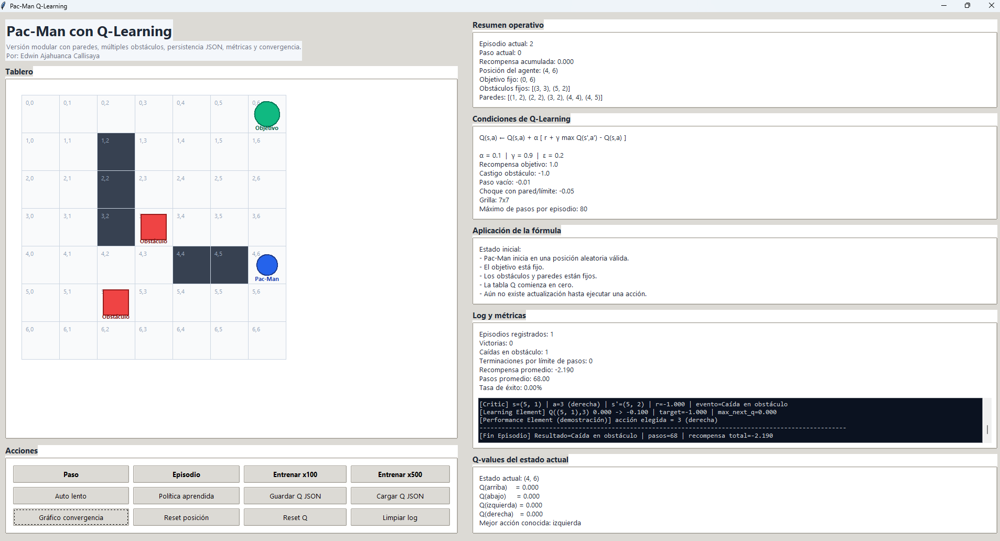

# Pac-Man Q-Learning

Aplicación desarrollada en Python que implementa un entorno tipo grid para entrenar un agente mediante **Q-Learning**. El proyecto simula un escenario donde Pac-Man debe aprender a desplazarse desde posiciones iniciales aleatorias hasta un objetivo fijo, evitando obstáculos y paredes, mientras mejora progresivamente su política de decisión.

La solución incorpora una **interfaz gráfica en Tkinter**, persistencia de la tabla Q en formato JSON, métricas de entrenamiento y exportación de gráficos de convergencia para analizar el comportamiento del aprendizaje.

---

## Características principales

- Inicialización de Pac-Man en una posición aleatoria válida.
- Objetivo fijo dentro del tablero.
- Múltiples obstáculos definidos en posiciones fijas.
- Paredes reales que restringen el movimiento.
- Implementación del algoritmo **Q-Learning** con política **ε-greedy**.
- Persistencia de la tabla Q en archivos JSON.
- Registro de métricas por episodio.
- Exportación de gráfico de convergencia en formato PNG.
- Interfaz gráfica didáctica para observar el aprendizaje paso a paso.

---

## Arquitectura del proyecto

La solución se encuentra organizada en módulos con responsabilidades claramente separadas, lo que facilita su mantenimiento, extensión y comprensión.

### `config.py`
Define la configuración central del sistema, incluyendo:
- dimensiones del tablero,
- hiperparámetros del algoritmo (`alpha`, `gamma`, `epsilon`),
- esquema de recompensas,
- posiciones del objetivo, obstáculos y paredes.

### `environment.py`
Implementa la lógica del entorno o tablero:
- validación de límites,
- detección de paredes,
- identificación de obstáculos,
- verificación del objetivo,
- transición de estados,
- cálculo de recompensas por movimiento.

### `agent.py`
Contiene la lógica del agente inteligente:
- administración de la tabla Q,
- consulta y actualización de valores Q,
- selección de acciones con política ε-greedy,
- aprendizaje mediante la ecuación de Q-Learning.

### `metrics.py`
Gestiona las métricas del entrenamiento:
- recompensas acumuladas por episodio,
- cantidad de pasos,
- número de victorias,
- caídas en obstáculos,
- terminaciones por límite de pasos,
- generación de gráfico de convergencia.

### `persistence.py`
Responsable de la persistencia de la tabla Q:
- guardado en formato JSON,
- carga de valores previamente aprendidos,
- reconstrucción de la estructura `(estado, acción)`.

### `gui.py`
Implementa la interfaz gráfica del sistema:
- visualización del tablero,
- controles de entrenamiento,
- paneles de resumen y fórmula,
- log operativo,
- exportación y carga de datos.

### `main.py`
Punto de entrada de la aplicación. Inicializa la ventana principal y ejecuta la interfaz gráfica.

---

## Requisitos

Para ejecutar el proyecto se requiere:

- **Python 3.12** o superior
- **Tkinter**
- **matplotlib**

---

## Instalación

### Opción 1: instalación rápida
```bash
pip install matplotlib
```

### Opción 2: entorno virtual recomendado

Se recomienda aislar dependencias en un entorno virtual específico para el proyecto.

```bash
py -3.12 -m venv envPacman
```

### Activación del entorno virtual en Windows

```bash
envPacman\Scripts\activate
```

### Instalación de dependencias

```bash
pip install -r requirements.txt
```

### Ejecución del Programa

Ubicarse en la carpeta raíz del proyecto y ejecutar:

```bash
python main.py
```

### Controles disponibles en la interfaz

* **Paso:** ejecuta una sola iteración del agente.
* **Episodio:** ejecuta automáticamente un episodio completo hasta finalizar.
* **Entrenar x100 / x500:** realiza entrenamiento masivo en múltiples episodios.
* **Auto lento:** ejecuta un episodio de forma automática y visual paso a paso.
* **Política aprendida:** muestra el comportamiento del agente explotando únicamente la mejor acción conocida.
* **Guardar Q JSON:** guarda la tabla Q actual en un archivo JSON.
* **Cargar Q JSON:** carga una tabla Q previamente almacenada.
* **Gráfico convergencia:** exporta un gráfico de desempeño del entrenamiento en formato PNG.
* **Reset posición:** reinicia únicamente la posición de Pac-Man sin eliminar el conocimiento aprendido.
* **Reset Q:** reinicia la tabla Q y las métricas acumuladas.

### Esquema de recompensas

El entorno utiliza el siguiente modelo de recompensas para guiar el aprendizaje del agente:

  * Objetivo alcanzado: **+1.0**
  * Caída en obstáculo: **-1.0**
  * Paso vacío: **-0.01**
  * Choque con pared o límite: **-0.05**

Este esquema incentiva al agente a encontrar rutas eficientes hacia el objetivo, evitando movimientos innecesarios, colisiones y estados no deseados.

### Recomendaciones de uso

Ejecutar primero episodios cortos o entrenamiento gradual para observar el comportamiento inicial del agente.

Utilizar la opción de guardar la tabla Q cuando se obtenga una política con resultados aceptables.

Exportar el gráfico de convergencia para documentar la evolución del aprendizaje.

Reiniciar únicamente la posición cuando se desee probar el conocimiento ya aprendido sin perder entrenamiento.

## Gráfico del proyecto

A continuación se presenta un ejemplo del gráfico de convergencia generado durante el entrenamiento del agente Q-Learning:

